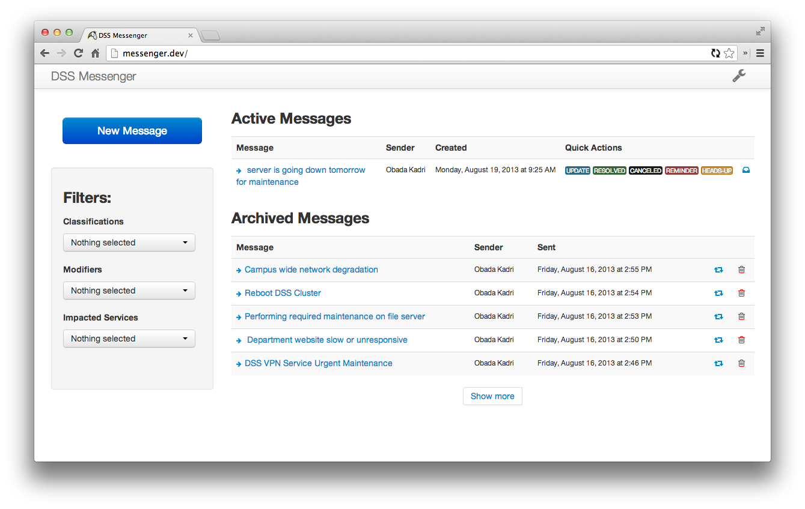
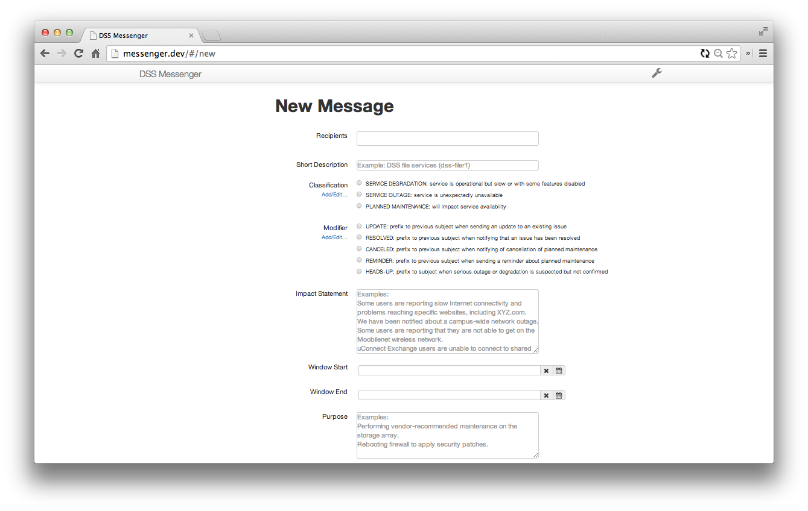
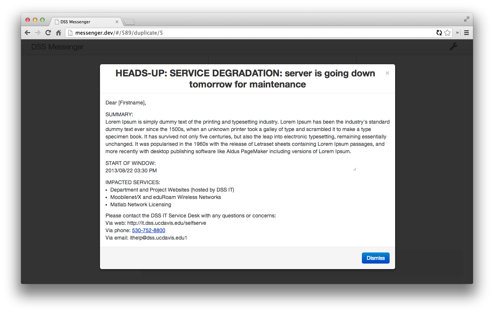
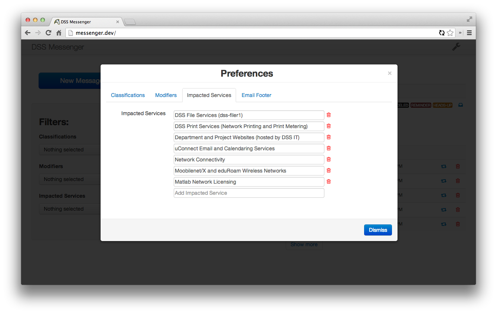

## DSS Messenger

The main purpose of Messenger is sending emails to DSS users about updates, reminders
, cancellations... of IT service degradations, outages or planned maintenance.

# Requirements

Messenger was written for Ruby 1.9 and Rails 3.2 and is deployed using Unicorn and PostgreSQL.
It has been tested on Apache and Nginix and should run fine on Linux, Mac OS X, and Windows.
It has not been tested with Microsoft's IronRuby, and as of this writing, IronRuby does not support Ruby 1.9, which is a requirement for this application.

Messenger also depends on DSS Roles Management (https://github.com/cthielen/roles-management).

# Deployment

Messenger is designed to be re-deployable in any organization, though there are a few matters of configuration that need to be attended to:

config/dss_rm.example.yml Move this file to config/dss_rm.yml and set the appropriate values.

config/environment.rb Recode the cas.ucdavis.edu URL to your CAS server, or remove CAS entirely. If you decide to remove CAS, also remove the before_filter in app/controllers/application_controller.rb.

config/deploy.rb You'll likely want to set this to your own Capistrano setup or delete it if you do not use Capistrano.

# Screenshots

# Authors

Obada Kadri (okadri@ucdavis.edu)  
Eric Lin (ericflin@ucdavis.edu)
